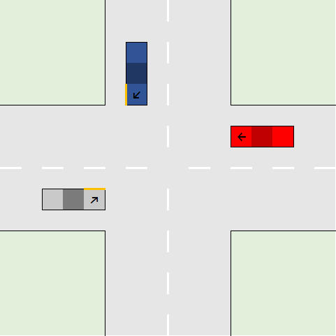

# crossroads_logic
## Description
Defines the right of way logic on a crossroads using prolog.
The allow function checks based on a predefined case if a car is allowed to drive.

## Testing Information
For easy testing of all relevant cases examples for all relevant cases are created. You just have to outcommend the case you want to test.
To run the code you have to install [SWI-Prolog] (https://www.swi-prolog.org/)

## Code-Structure
### templates
Excel-Template to generate a schematic-graphic for the crossroads

### graphics
schematics for each case that is handeled in the code

### code
main code in prolog
